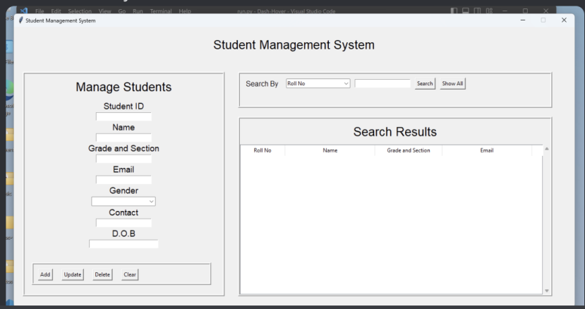
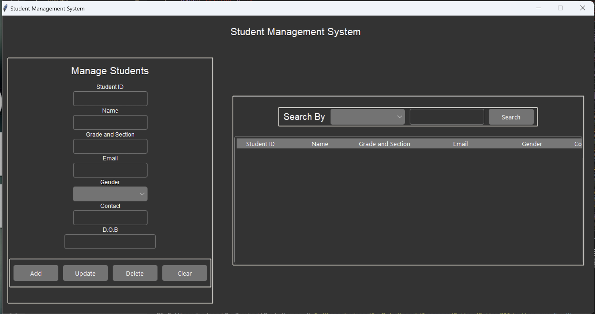
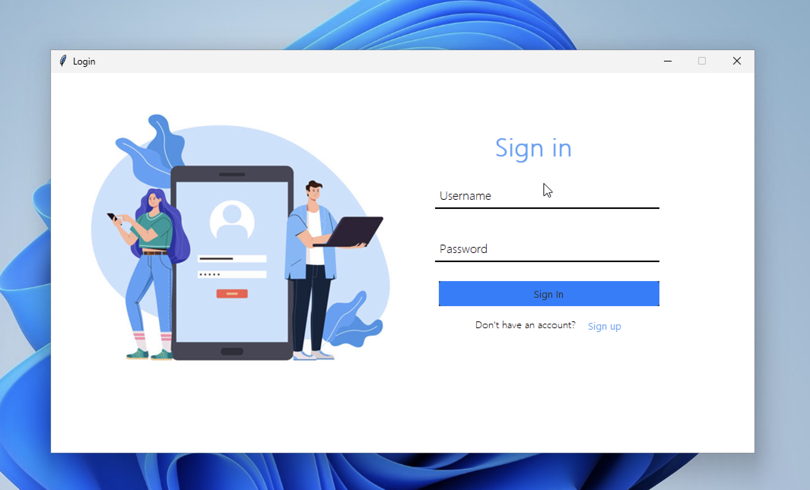
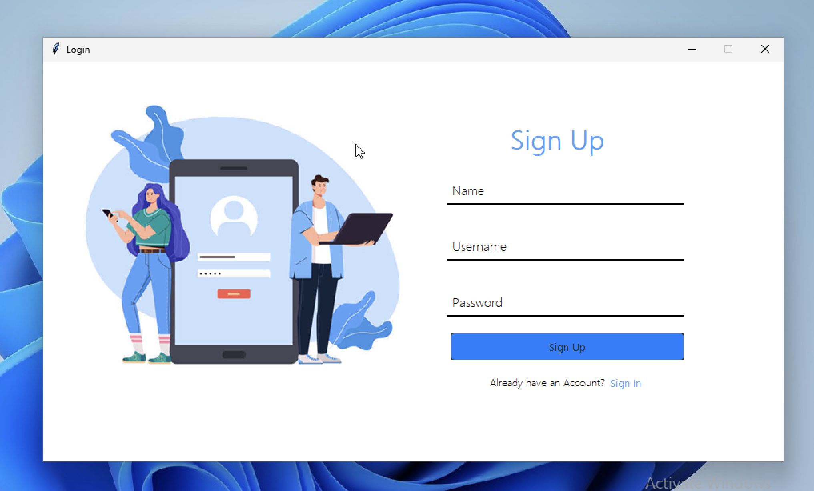
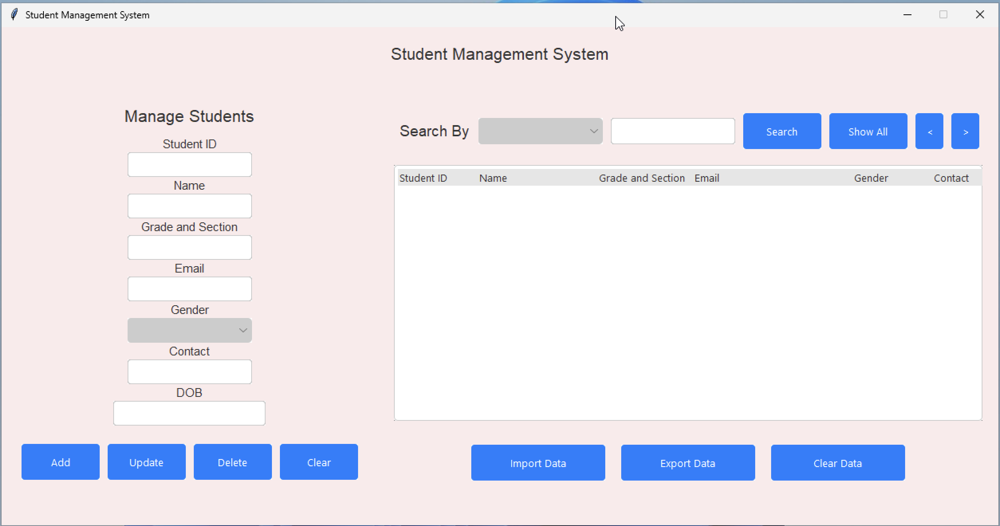
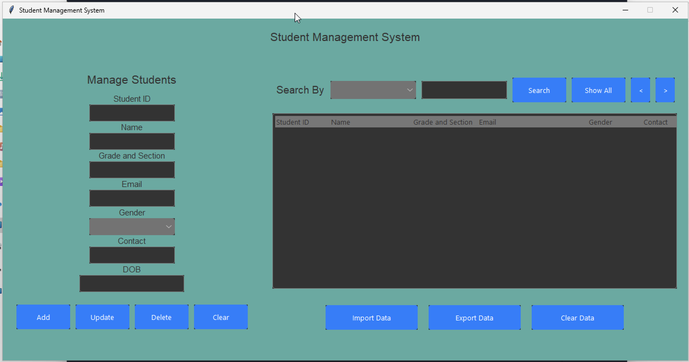

Welcome to <bold>Student Data Management System</bold>

- A super cozy and super flexible Database Management System using Modded Tkinter GUI and MySQL for the Data Management

<bold> What's Modded Tkinter GUI ? </bold> 
- So Basically Tkinter is a GUI interface made with TCL provided by Python itself .
  
However the GUI is made strictly for prototyping and testing .. Hence Python stopped maintaining the GUI designs.

  But they did make a new module design called "ttk" but that limits the oppurtunities for designing the GUi

  Here is my take to design Tkinter GUI like a real app 🌇

------------------------------------------------------------------------------------------------------------------------------------

  <bold> Original Tkinter GUI </bold>
  

  <bold> My Tkinter GUI ( Modded ) </bold>
  

  
This is why u will find half of the folder with TCL files 😅

<bold>Well... This doesn't end here ... 😎</bold>

------------------------------------------------------------------------------------------------------------------------------------
<bold> FEATURES </bold>
 - Super cool Login and Signup System allowing Full ownership of the data only to the ADMIN's

   <bold>LOGIN</bold>
   
   <bold>SIGN-UP</bold>
   

   <bold>My Baby No.1 ( Pink - White )</bold>  'light' 🌩️
   

   <bold>My Baby No.2 (Green - Black )</bold>  'dark' 🎯
   

 ------------------------------------------------------------------------------------------------------------------------------------  
Inorder to change between these themes ... Open 'student_system.py' and search for this line 'self.root.tk.call("set_theme", "Light/Dark")' 
Change that according to the color preference or you can mess with different variations by opening 'azure.tcl' and change the color scheming as per your choice 😊

   
 
Check out this cool Project and if you like it pls leave it a star ⭐... 

 Leave a ⭐ .. or identify yourself as a Walmart bag 🔫

